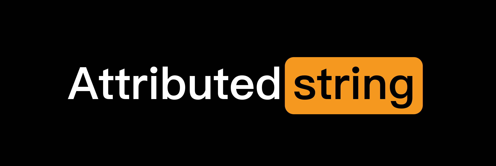

AttributedString - 基于Swift插值方式优雅的构建富文本

[](LICENSE)&nbsp;


## 特性

- [x] 使用插值构建富文本 流畅的编码体验 优雅自然的样式设置.
- [x] 丰富的控件扩展支持.
- [x] 支持多层富文本嵌套并提供嵌套样式优先级策略.
- [x] 支持全部`NSAttributedString.Key`特性.
- [x] 支持 iOS & macOS & watchOS & tvOS.
- [x] 支持文本和附件点击回调
- [x] 更多新特性的不断加入.


## 截屏


<div align="center">


</div>


<div align="center">


</div>


## 安装

**CocoaPods - Podfile**

```ruby
pod 'AttributedString'
```

**Carthage - Cartfile**

```ruby
github "lixiang1994/AttributedString"
```


## 使用

首先导入

```swift
import AttributedString
```


初始化

```swift
// 常规初始化
let a: AttributedString = .init("lee", .font(.systemFont(ofSize: 13)))
// 插值初始化
let b: AttributedString = "\("lee", .font(.systemFont(ofSize: 13)))"
```


下面是一些简单示例. 支持所有设备和模拟器:


#### 字体:

```swift
textView.attributed.text = """

\("fontSize: 13", .font(.systemFont(ofSize: 13)))

\("fontSize: 20", .font(.systemFont(ofSize: 20)))

\("fontSize: 22 weight: semibold", .font(.systemFont(ofSize: 22, weight: .semibold)))

"""
```

#### 字色:

```swift
textView.attributed.text = """

\("foregroundColor", .color(.white))

\("foregroundColor", .color(.red))

"""
```

#### 删除线: 

```swift
textView.attributed.text = """

\("strikethrough: single", .strikethrough(.single))

\("strikethrough: double color: .red", .strikethrough(.double, color: .red))

"""
```

#### 图片: 	(不包括watchOS)

```swift
textView.attributed.text = """

\(.image(UIImage(named: "xxxx")))

\(.image(UIImage(named: "xxxx"), .custom(size: .init(width: 200, height: 200))))

\(.image(UIImage(named: "xxxx"), .proposed(.center))).

"""
```

#### 包装:

```swift
let a: AttributedString = .init("123", .background(.blue))
let b: AttributedString = .init("456", .background(.red))
textView.attributed.text = "\(wrap: a) \(wrap: b, .paragraph(.alignment(.center)))"

// 默认为嵌入模式, 嵌套的内部样式优先于外部样式
textView.attributed.text = "\(wrap: a, .paragraph(.alignment(.center)))"
textView.attributed.text = "\(wrap: .embedding(a), .paragraph(.alignment(.center)))"
// 覆盖模式, 嵌套的外部样式优先于内部样式
textView.attributed.text = "\(wrap: .override(a), .paragraph(.alignment(.center)))"
```

#### 拼接:

```swift
let a: AttributedString = .init("123", .background(.blue))
let b: AttributedString = .init("456", .background(.red))
let c: AttributedString = .init("789", .background(.gray))
textView.attributed.text = a + b
textView.attributed.text += c
```

#### 点击:	(仅支持 iOS: UILabel / UITextView 和 macOS: NSTextField)

```swift
// 文本
let a: AttributedString = .init("lee", .action({  }))
// 附件 (图片)
let b: AttributedString = .init(.image(image), action: {
    // code
})

// 建议使用函数作为参数 语法上比直接使用闭包更加整洁.
func click() {
    // code
}
// 正常初始化
let c: AttributedString = .init("lee", .action(click))
let d: AttributedString = .init(.image(image), action: click)
// 字面量初始化
let e: AttributedString = "\("lee", .action(click))"
let f: AttributedString = "\(.image(image), action: click)"

// 获取更多信息 
func click(_ action: AttributedString.Action) {
    switch action.content {
    case .string(let value):
        print("点击了文本: \(value) range: \(action.range)")
                
    case .attachment(let value):
        print("点击了附件: \(value) range: \(action.range)")
    }
}

label.attributed.text = "This is \("Label", .font(.systemFont(ofSize: 20)), .action(click))"
textView.attributed.text = "This is a picture \(.image(image, .custom(size: .init(width: 100, height: 100))), action: click) Displayed in custom size."
```


更多示例请查看工程应用.


## 通过`Attribute`类提供的属性

以下属性可用：

| 属性              | 类型                                 | 描述                                         |
| ----------------- | ------------------------------------ | -------------------------------------------- |
| font              | `UIFont`                             | 字体                                         |
| color             | `UIColor`                            | 字色                                         |
| background        | `UIColor`                            | 背景色                                       |
| paragraph         | `ParagraphStyle`                     | 段落样式                                     |
| ligature          | `Bool`                               | 连体字                                       |
| kern              | `CGFloat`                            | 字间距                                       |
| strikethrough     | `NSUnderlineStyle` . `UIColor`       | 删除线样式与颜色 (如果颜色为空 则和字色一致) |
| underline         | `NSUnderlineStyle` , `UIColor`       | 下划线样式与颜色 (如果颜色为空 则和字色一致) |
| link              | `String` / `URL`                     | 链接                                         |
| baselineOffset    | `CGFloat`                            | 基准线偏移                                   |
| shadow            | `NSShadow`                           | 阴影                                         |
| stroke            | `CGFloat`, `UIColor`                 | 描线宽度与颜色                               |
| textEffect        | `NSAttributedString.TextEffectStyle` | 文本效果                                     |
| obliqueness       | `CGFloat`                            | 斜体                                         |
| expansion         | `CGFloat`                            | 拉伸/压缩                                    |
| writingDirection  | `WritingDirection` / `[Int]`         | 书写方式                                     |
| verticalGlyphForm | `Bool`                               | 垂直排版 (当前在iOS上, 它始终是水平的)       |


## 贡献

如果您需要实现特定功能或遇到错误，请打开issue。
如果您自己扩展了AttributedString的功能并希望其他人也使用它，请提交拉取请求。

## 协议

AttributedString 使用 MIT 协议. 有关更多信息，请参阅[LICENSE](LICENSE)文件.
